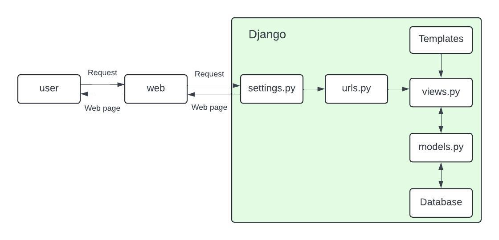
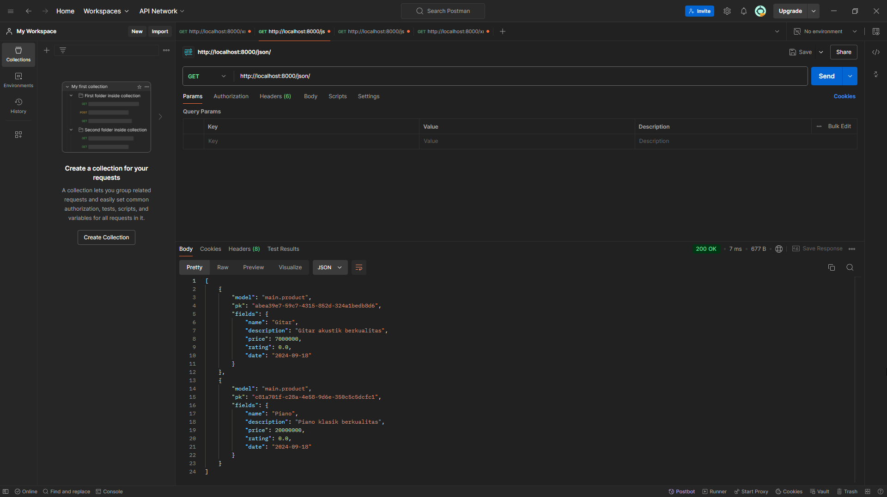
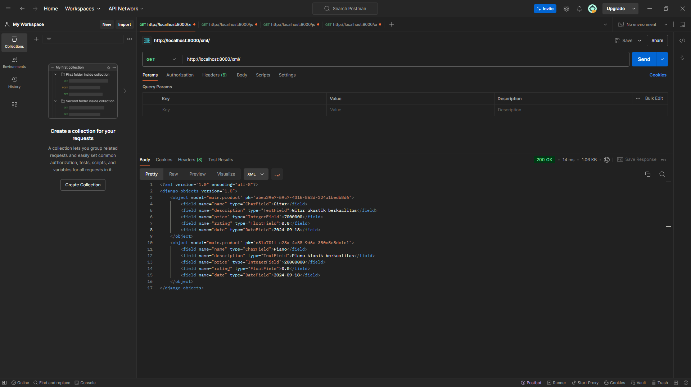
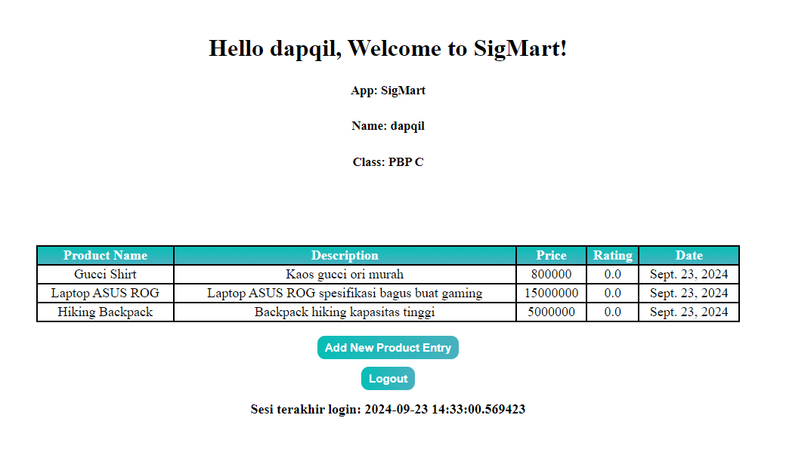
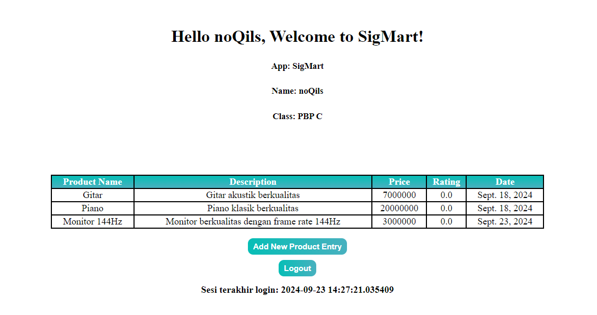

## Profile
***Nama:*** Daffa Aqil Mahmud  
***NPM:*** 2306245056  
***Kelas:*** PBP C

## Project Link
**Link:** http://daffa-aqil31-sigmart.pbp.cs.ui.ac.id

## Jawaban Pertanyaan Tugas 2
***1. Jelaskan bagaimana cara kamu mengimplementasikan checklist di atas secara step-by-step!***  
* **Checklist 1:**
    1. Membuat repositori github baru dengan nama sigmart.
    2. Membuat direktori lokal utama bernama sigmart.
    3. Membuat virtual environtment pada direktori utama dan mengaktifkannya.
    4. Virtual environtment digunakan untuk menginstall library-library python yang dibutuhkan seperti Django, Gunicorn, URLLib3, dan lain-lain.
    5. Memulai projek Django baru dengan menjalankan perintah `django-admin startproject sigmart .`
    6. Menambahkan host lokal dan host dari server pws ke variabel `ALLOWED_HOST` pada modul `settings.py` agar projek dapat diakses dari server lokal dan pws.
    7. Membuat projek baru pada akun pws saya dengan nama sigmart.
    8. Menghubungkan projek sigmart pada pws dengan direktori sigmart yang terdapat pada direktori lokal saya.
    9. Melakukan add-commit-push ke github dan deploy ke pws.
* **Checklist 2:**
    1. Membuat direktori main (aplikasi main) dengan menggunakan fungsi "startapp" yang ada di dalam modul `manage.py`.
    2. Menambahkan aplikasi main ke dalam variabel “INSTALLED_APPS” pada `settings.py` untuk mendaftarkan aplikasi main ke projek sigmart.
    3. Membuat direktori baru dalam direktori main beenama “templates”.
    4. Membuat file html bernama `main.html` dalam direktori template yg baru dibuat. File html ini berfungsi untuk mengatur tampilan dari aplikasi.
* **Checklist 3:**
    1. Pada direktori projek utama terdapat modul bernama `urls.py`. Pada file tersebut saya menambahkan rute URL yang mengarah ke tampilan main.
* **Checklist 4:**
    1. Membuat class bernama Product dalam `models.py` yang terdapat dalam aplikasi main.
    2. Menambahkan atribut-atribut wajib di dalam class Product yaitu name (nama produk/item), price (harga produk), dan description (deskripsi penjelasan tentang produk).
    3. Selain atribut wajib, saya juga menambahkan dua atribut lain, yaitu rating (rating dari pembeli tentang produk) dan date (tanggal).
* **Checklist 5:**
    1. Menambahkan fungsi show_main dalam modul `views.py` pada aplikasi main.
    2. Membuat variabel dictionary baru bernama context. Dictionary ini akan diisi dengan data-data yang akan ditampilkan saat aplikasi main diakses.
    3. Menambahkan data-data berupa informasi nama aplikasi, nama saya, dan kelas PBP di dalam dictionary context.
    4. Menambahkan kode dalam `main.html` yang sudah dibuat pada checklist pertama sehingga file `main.html` dapat menampilkan ucapan selamat datang dan juga menampilkan data-data yang ada dalam dictionary context.
* **Checklist 6:**
    1. Membuat modul `urls.py` dalam direktori main. Modul ini bertanggung jawab dalam mengatur rute URL yang berkaitan dengan aplikasi main. Modul `urls.py` dalam aplikasi main akan memanggil fungsi show_main yg ada pada modul view.py sebagai tampilan yang akan ditampilkan ketika URL diakses.
    2. Membuat return render yang akan me-render tampilan dari `main.html`.
 * **Checklist 7:**
    1. Setelah langkah-langkah pada checklist sebelumnya dilakukan, saya melakukan add-commit-push untuk kedua kalinya untuk memperbarui halaman repositori sigmart pada github saya.
    2. Setelah push ke github, langkah terakhir adalah untuk push ke server pws (deployment) untuk memperbarui server pws sigmart.

***2. Bagan Request-Respond Django:***  

Request yang dikirim oleh user melalui web browser akan dikirim ke server dan diterima oleh `urls.py`. Lalu, berdasarkan URL yang diterima, `urls.py` akan mengatur/menentukan (routing) request tersebut diteruskan ke fungsi atau class mana yang berada di dalam `views.py`. `views.py` adalah modul yang mengatur jalannya logika aplikasi. Jika diperlukan, `views.py` dapat menentukan untuk mengakses `models.py` untuk dapat berinteraksi dengan database. Setelah semua request telah dijalankan, `views.py` akan me-render berkas HTML untuk ditampilkan ke user.

***3. Jelaskan fungsi git dalam pengembangan perangkat lunak!***   
Git utamanya digunakan untuk dokumentasi source code. Git memungkinkan untuk menyimpan,  mengelola, dan berbagi source code secara efisien dan kolaboratif. Selain itu, developers juga dapat melacak perubahan kode, membuat backup, dan menyimpan versi-versi berbeda dari source code yang mereka buat. Dengan kemampuan yang ditawarkan tersebut, git sangatlah berguna dalam membantu pengembangan perangkat lunak

***4. Menurut Anda, dari semua framework yang ada, mengapa framework Django dijadikan permulaan pembelajaran pengembangan perangkat lunak?***  
Menurut saya, Django digunakan untuk permulaan pembelajaran pengembangan perangkat lunak karena mudah dipelajari dan digunakan. Django juga menyediakan banyak fitur bawaan yang diperlukan untuk pengembangan aplikasi web, sehingga pemula tidak perlu repot-repot mengonfigurai banyak komponen eksternal. Selain itu, Django adalah framework yang berbasis python, dan python adalah bahasa yang paling mudah untuk dipelajari oleh pemula karena bahasanya yang simpel. Hal ini akan memudahkan pemula dalam mempelajari pengembangan perangkat lunak menggunakan Django.

***5. Mengapa model pada Django disebut sebagai ORM?***  
Model pada Django disebut ORM karena Django menerapkan ORM untuk mengelola interaksi objek dan database. ORM sendiri adalah teknik pemrograman yang menghubungkan atau memetakan objek dalam kode program ke tabel-tabel dalam database relasional, seperti PostgreSQL, MySQL, SQLite, dan lainnya. Pada Django, ORM digunakan untuk menerjemahkan operasi pada objek model python ini menjadi query SQL yang sesuai untuk mengakses, menyimpan, mengubah, atau menghapus data dalam database. Oleh karena itu, model Django disebut sebagai ORM.

## Jawaban Pertanyaan Tugas 3
***1. Jelaskan mengapa kita memerlukan data delivery dalam pengimplementasian sebuah platform?***  
Data delivery adalah tulang punggung dalam pengimplementasian sebuah platform karena memungkinkan akses cepat, konsisten, dan aman terhadap data yang dibutuhkan oleh pengguna atau komponen lain dalam platform. Tanpa data delivery yang bagus, platform tidak akan dapat beroperasi secara efisien, mengurangi keandalan, skalabilitas, dan kualitas pengalaman pengguna.

***2. Menurutmu, mana yang lebih baik antara XML dan JSON? Mengapa JSON lebih populer dibandingkan XML?***  
Menurut saya, JSON lebih baik daripada XML karena format penjabaran informasi pada JSON lebih mudah untuk dibaca dan dipahami (lebih *human-readable*). Hal itu juga merupakan hal yang membuat JSON lebih populer dari XML.

***3. Jelaskan fungsi dari method `is_valid()` pada form Django dan mengapa kita membutuhkan method tersebut?***  
Method `is_valid` pada Django memiliki peran untuk memastikan data yang diproses sudah valid (dalam format yang tepat), sehingga dapat menghindari memproses data-data yang rusak.

***4. Mengapa kita membutuhkan csrf_token saat membuat form di Django? Apa yang dapat terjadi jika kita tidak menambahkan `csrf_token` pada form Django? Bagaimana hal tersebut dapat dimanfaatkan oleh penyerang?***  
`csrf_token` dalam form Django sangat penting untuk mencegah serangan Cross-Site Request Forgery (CSRF) yang bisa memanipulasi aplikasi untuk melakukan tindakan yang tidak diinginkan atas nama pengguna yang sah. Jika tidak menambahkan csrf_token, aplikasi yang dibuat menjadi rentan terhadap berbagai serangan yang bisa dieksploitasi oleh penyerang (hacker) untuk mencuri data, mengubah pengaturan akun, atau melakukan transaksi berbahaya.

***5. Jelaskan bagaimana cara kamu mengimplementasikan checklist di atas secara step-by-step!***  
* **Checklist 1:**
    1. Membuat direktori `templates` di folder root dan membuat file `base.html` di dalamnya.
    2. Menghapus file `db.sqlite3` sebelumnya.
    3. Mengubah id yang tadinya integer menjadi UUID.
    4. Membuat file `forms.py` di direktori `main`.
    5. Menambahkan list `field` di dalam `forms.py` dengan nilai `["name", "description", "price"]`.
    6. Menambahkan fungsi `create_product_entry` pada modul `views.py`.
    7. Menambahkan pattern urls dari fungsi `create_product_entry` ke `urls.py` yang ada dalam direktori `main`.
    8. Membuat file `create_product_entry.html` untuk tampilan memasukkan product baru.
    9. Menampilkan data `Product` yang telah dimasukkan dengan mengubah isi `main.html`.
* **Checklist 2:**
    1. Menambahkan fungsi-fungsi pada modul `views.py` untuk mendapatkan informasi objek yang sudah dimasukkan ke aplikasi dalam format XML, JSON, XML by id, dan JSON by id.
* **Cheklist 3:**
    1. Menambahkan pattern urls dari fungsi-fungsi XML dan JSON yang telah ditambahkan di `views.py` ke `urls.py` yang ada dalam direktori `main`.

***6. ScreenShot JSON dan XML***  
 
 
 


## Jawaban Pertanyaan Tugas 4
***1. Apa perbedaan antara `HttpResponseRedirect()` dan `redirect()`***  
* **HttpResponseRedirect()** hanya menerima URL string dan lebih manual dalam penggunaannya.
* **redirect()** lebih fleksibel karena mendukung lebih banyak jenis argumen dan memudahkan pengembangan.

***2. Jelaskan cara kerja penghubungan model `Product` dengan `User`!***  
Menggunakan `models.ForeignKey` untuk menghubungkan setiap produk ke satu pemilik (User). Dengan ini, setiap produk yang dimasukkan ke sistem akan hanya dimiliki oleh user yang sedang login saat menambahkan produk tersebut.

***3. Apa perbedaan antara authentication dan authorization, apakah yang dilakukan saat pengguna login? Jelaskan bagaimana Django mengimplementasikan kedua konsep tersebut.***  
* **Authentication** adalah proses verifikasi identitas pengguna. Ini mencakup memastikan bahwa pengguna adalah siapa yang mereka klaim dengan cara memeriksa kredensial mereka, seperti username dan password.
    * Saat pengguna melakukan login, Django menggunakan modul `django.contrib.auth` untuk memverifikasi kredensial pengguna.
    * Jika kredensial valid, pengguna dianggap terautentikasi dan dapat mengakses bagian tertentu dari aplikasi.
* **Authorization** adalah proses menentukan apakah pengguna yang terautentikasi memiliki izin untuk mengakses sumber daya tertentu atau melakukan tindakan tertentu. Ini berhubungan dengan kontrol akses.
    * Setelah pengguna terautentikasi, sistem dapat memeriksa apakah mereka memiliki izin untuk mengakses view atau melakukan tindakan tertentu, seperti mengedit atau menghapus data.
    * Django menyediakan decorator seperti `@login_required` dan sistem izin untuk membantu mengelola otorisasi.

***4. Bagaimana Django mengingat pengguna yang telah login? Jelaskan kegunaan lain dari cookies dan apakah semua cookies aman digunakan?***  
* **Cara Django Mengingat Pengguna yang Telah Login**
    1. **Sesi:**  
        Saat pengguna berhasil login, Django membuat sesi untuk pengguna tersebut. Sesi ini menyimpan informasi tentang pengguna, seperti ID pengguna, yang akan digunakan untuk mengidentifikasi mereka di permintaan berikutnya.
    2. **Cookies:**  
        Django menggunakan cookies untuk menyimpan ID sesi di sisi klien. Cookie ini biasanya disebut sessionid. Setiap kali pengguna melakukan permintaan ke server, browser mengirimkan cookie ini bersama dengan permintaan tersebut. Django dapat menggunakan ID sesi yang terdapat dalam cookie untuk mengambil informasi sesi dari server.
    3. **Penyimpanan Sesi:**  
        Informasi sesi dapat disimpan di berbagai backend, seperti database, cache, atau filesystem, tergantung pada pengaturan aplikasi.
* **Kegunaan Lain dari Cookies**
    1. **Personalisasi:**  
        Cookies dapat digunakan untuk menyimpan preferensi pengguna, seperti tema atau bahasa yang dipilih.
    2. **Pelacakan:**  
        Cookies sering digunakan untuk melacak perilaku pengguna di situs web, seperti halaman yang dikunjungi dan produk yang dilihat. Ini berguna untuk analisis dan pengoptimalan.
    3. **Pengiklanan:**  
        Banyak layanan iklan menggunakan cookies untuk melacak efektivitas iklan dan menampilkan iklan yang relevan berdasarkan perilaku pengguna.
    4. **Keamanan:**  
        Cookies dapat membantu dalam meningkatkan keamanan aplikasi, misalnya, dengan menyimpan token untuk otorisasi.
* **Keamanan Cookies**
    Tidak semua cookies aman digunakan. Meskipun cookies sangat berguna untuk mengelola sesi pengguna dan menyimpan informasi lain, ada beberapa risiko dan kondisi yang dapat membuat cookies tidak aman.
    1. **Risiko Keamanan Cookies**
        * **XSS (Cross-Site Scripting):** Jika aplikasi web rentan terhadap serangan XSS, penyerang dapat menyisipkan skrip berbahaya ke dalam halaman yang dapat mengakses cookies pengguna. Jika cookies tidak diatur dengan flag HttpOnly, penyerang bisa mencuri informasi sensitif yang tersimpan dalam cookies.
        * **CSRF (Cross-Site Request Forgery):** Cookies yang tidak dilindungi dapat digunakan dalam serangan CSRF, di mana penyerang memanfaatkan sesi pengguna yang sudah terautentikasi untuk melakukan tindakan tanpa sepengetahuan pengguna.
        * **Man-in-the-Middle Attacks:** Jika cookie tidak dilindungi oleh HTTPS (dengan flag Secure), penyerang dapat menangkap cookies dalam perjalanan antara klien dan server, terutama dalam koneksi yang tidak aman.
    2. **Kebocoran Data Sensitif**
        * **Data Pribadi:** Jika aplikasi menyimpan data pribadi atau informasi sensitif (seperti password, nomor kartu kredit, dll.) dalam cookies, itu bisa berisiko. Cookies bisa diakses oleh pengguna lain yang menggunakan perangkat yang sama atau melalui serangan.
    4. **Cookies Permanen vs. Cookies Sesi**
        * **Cookies Permanen:** Cookies yang disimpan untuk periode yang lebih lama dapat menjadi target bagi penyerang. Jika seorang penyerang mendapatkan akses ke perangkat pengguna, mereka dapat mengakses cookies yang tersimpan dan melakukan penyalahgunaan.
        * **Cookies Sesi:** Meskipun lebih aman karena hanya aktif selama sesi pengguna, jika tidak diatur dengan baik, mereka masih dapat berisiko jika terdapat kerentanan keamanan lainnya.

***5. Jelaskan bagaimana cara kamu mengimplementasikan checklist di atas secara step-by-step***  
* **Checklist 1:**
    * **Registrasi:**
        1. Menyalakan virtual environment.
        2. Import `UserCreationForm` dan `messages` ke modul `views.py` yang ada di direktori `main`.
        3. Menambahkan fungsi register pada `views.py` untuk mengatur logic saat registrasi ingin dilakukan.
        4. Membuat file `register.html` di direktori `templates` yang ada di direktori `main`. File ini akan menampilkan laman registrasi tempat dimana registrasi dapat dilakukan.
        5. Mengimport fungsi register yang telah dibuat ke modul `urls.py` dan menambahkan routing fungsi tersebut pada list `urlpatterns`.
    * **Login:**
        1. Import `authenticate`, `login`, dan `AuthenticationForm` ke `views.py`.
        2. Membuat fungsi `login_user` di dalam `views.py` untuk mengatur logic proses login.
        3. Membuat file `login.html` di direktori `templates` yang ada di direktori `main`. File ini akan menampilkan laman login tempat dimana login dapat dilakukan.
        4. Mengimport fungsi login yang telah dibuat ke modul `urls.py` dan menambahkan routing fungsi tersebut pada list `urlpatterns`.
    * **Logout:**
        1. Import `logout` ke `views.py`.
        2. Membuat fungsi `logout_user` di dalam `views.py` untuk mengatur logic proses logout.
        3. Membuat file `logout.html` di direktori `templates` yang ada di direktori `main`. File ini akan menampilkan laman logout tempat dimana logout dapat dilakukan.
        4. Mengimport fungsi logout yang telah dibuat ke modul `urls.py` dan menambahkan routing fungsi tersebut pada list `urlpatterns`.
* **Checklist 2:**
    1. Menjalankan aplikasi sigmart secara local dengan command `python manage.py runserver`.
    2. Membuat 2 akun baru dengan meng-klik tombol register di login page.
    3. Memasukan 3 produk (nama produk, deskripsi, dan harga) di setiap akun yang dibikin.
    
    
* **Checklist 3:**
    1. Import `from django.contrib.auth.models import User` ke `models.py`.
    2. Membuat dan menginstansiasi variabel user dalam class `Product` di modul `models.py` dengan value `models.ForeignKey(User, on_delete=models.CASCADE)`.
    3. Menambahkan potongan-potongan kode untuk mengimplementasikan fungsi user di modul `views.py`.
* **Checklist 4:**
    1. Membuka modul `views.py`.
    2. Mengubah isi dari key `name` pada dictionary `context` yang berada di dalam fungsi `show_main` menjadi `request.user.username` untuk menampilkan nama dari user yang sedang login.
    3. Menambahkan fungsi cookie bernama `last_login` ke dalam potongan kode `if form.is_valid()` yang ada di dalam fungsi `login_user`.
    4. Menambahkan fungsi `response.delete_cookie('last_login')` ke dalam fungsi `logout_user`.

***1. Jika terdapat beberapa CSS selector untuk suatu elemen HTML, jelaskan urutan prioritas pengambilan CSS selector tersebut!***  
Dalam CSS, ketika terdapat beberapa selector yang menerapkan aturan berbeda pada elemen yang sama, urutan prioritas (atau specificity) akan menentukan aturan mana yang akan diterapkan. Urutan prioritas CSS ditentukan berdasarkan specificity, aturan importance, dan urutan kemunculan dalam kode.
* **Aturan Importance:**
    * Aturan CSS yang menggunakan `!important` memiliki prioritas tertinggi dan akan mengesampingkan aturan lainnya
* **Specificity:**
    * Specificity dihitung berdasarkan kombinasi dari selector yang digunakan. Semakin tinggi nilainya, semakin tinggi prioritasnya.
* **Urutan Kemunculan:**
    * Jika dua selector memiliki specificity yang sama, aturan yang muncul terakhir dalam kode akan diterapkan. Ini dikenal sebagai cascading.

***2. Mengapa responsive design menjadi konsep yang penting dalam pengembangan aplikasi web? Berikan contoh aplikasi yang sudah dan belum menerapkan responsive design!***  
Responsive design penting karena memungkinkan situs web menyesuaikan tampilannya di berbagai perangkat, seperti desktop, tablet, dan ponsel, sehingga pengalaman pengguna tetap optimal. Ini meningkatkan kenyamanan navigasi, memperbaiki SEO karena mesin pencari seperti Google memprioritaskan situs responsif, serta mempermudah pengelolaan dibandingkan membuat versi terpisah untuk setiap perangkat. Contoh aplikasi yang sudah menerapkan responsive design adalah Medium dan Airbnb, sedangkan beberapa situs pemerintah lama dan situs usaha kecil seringkali belum responsif, menyebabkan tampilan tidak optimal di perangkat mobile.

***3. Jelaskan perbedaan antara margin, border, dan padding, serta cara untuk mengimplementasikan ketiga hal tersebut!***  
* **Margin:** Ruang kosong di luar elemen yang memisahkan elemen tersebut dari elemen lain di sekitarnya. Margin tidak memiliki warna dan bersifat transparan.
* **Border:** Garis yang mengelilingi elemen, terletak di antara margin dan padding. Border memiliki warna, ketebalan, dan gaya yang bisa diatur.
* **Padding:** Ruang di dalam elemen, antara konten elemen dan border-nya. Padding bersifat transparan, tetapi memperluas area yang bisa dipengaruhi oleh background elemen.
* **Contoh Implementasi:**
```
.container {
    margin: 20px;
    border: 2px solid black;
    padding: 15px;
}
```

***4. Jelaskan konsep flex box dan grid layout beserta kegunaannya!***  
* **Flexbox (Flexible Box Layout):**  
    * Flexbox adalah model layout satu dimensi yang digunakan untuk mengatur elemen dalam satu baris atau satu kolom. Flexbox dirancang untuk memberikan fleksibilitas dalam menyusun dan meratakan item di dalam container, terutama ketika ukuran item berubah.  
    * Kegunaan:  
        * Mengatur tata letak item secara horizontal atau vertikal.
        * Mudah untuk membuat elemen menjadi responsif, dengan kemampuan untuk meratakan item, mendistribusikan ruang di antara item, dan mengatur urutan item secara fleksibel.
        * Berguna untuk tata letak yang lebih sederhana, seperti navigasi horizontal, card layout, atau button group.
* **Grid Layout:**  
    * Grid Layout adalah model tata letak dua dimensi yang lebih kuat dan fleksibel dibandingkan Flexbox. Grid memungkinkan untuk mengatur elemen secara baik dalam baris maupun kolom, serta membagi area halaman menjadi grid yang kompleks.  
    * Kegunaan:  
        * Mengatur tata letak elemen secara vertikal dan horizontal (dua dimensi).
        * Sangat cocok untuk membuat layout kompleks seperti tata letak halaman penuh, dashboard, atau template halaman yang membutuhkan pengaturan presisi.
        * Membuat grid yang dapat diubah ukuran kolom atau barisnya sesuai dengan kebutuhan layout.

***5. Jelaskan bagaimana cara kamu mengimplementasikan checklist di atas secara step-by-step***  
* **Checklist 1:**
    1. Dalam modul `views.py`, menambahkan fungsi `edit_product` untuk mengedit produk dan fungsi `delete_product` untuk menghapus produk.
    2. Melakukan routing kedua fungsi tersebut dengan meng-import fungsi `edit_product` dan `delete_product` ke urls.py yang berada di direktori `main`.
    3. Menambahkan *url pattern* dari kedua fungsi tersebut ke dalam list `urlpatterns` di dalam modul `urls.py`.
    4. Membuat file `edit.html` di dalam direktori `templates` yand ada di direktori `main` untuk mengatur tampilan dari halaman saat mengedit produk.
* **Checklist 2:**
    1. Menambahkan Tailwind ke dalam projek django
    2. Membuat file `global.css` sebagai template CSS *style* untuk projek django.
    3. Mengisi file `global.css` dengan beberapa CSS *styling* seperti *custom background*.
    3. Mengkostumisasi *design* halaman *login*, *register*, *add product*, dan *edit product* menggunakan Tailwind.
    4. Menambahkan tampilan gambar dan pesan jika belum ada data produk yang dimasukkan oleh user yang sedang login.
    5. Membuat file `card_poduct.html` di dalam direktori `templates` dalam direktori `main` yang berfungsi untuk menampilkan informasi tentang produk-produk yang telah di *add*.
    6. Mengkostumisasi *design* tampilan *product card*.
    7. Menambahkan dua *button* untuk setiap *product card*. Satu untuk mengedit produk dan satu lagi untuk menghapus produk.
    8. Membuat file `navbar.html` pada direktori `templates` yang berada di direktori utama. File ini berfungsi untuk menampilkan *navigation bar* dari aplikasi.
    9. Mengkostumisasi *design navbar* untuk dapat beradaptasi dengan ukuran *device* (*desktop* atau *mobile*).